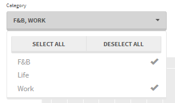
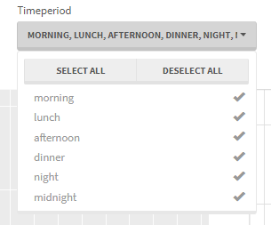
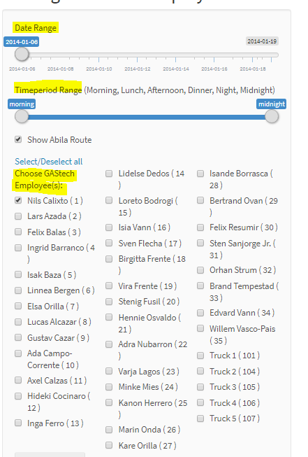
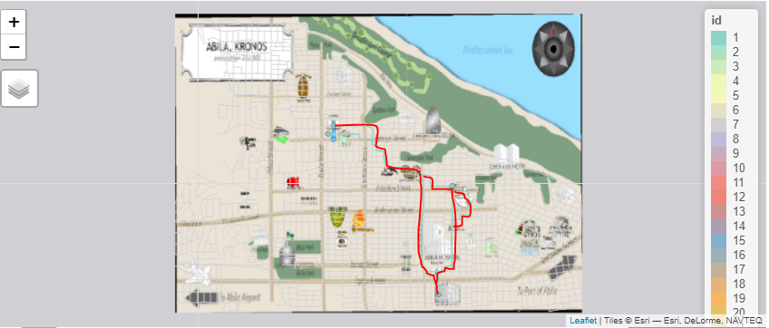

```{r setup, include=FALSE}
knitr::opts_chunk$set(echo = TRUE)
```

# Exploratory Data Analysis

This tab is to identify popular locations of Abila city and identify transaction anomalies.

- Users are able to select the categories of locations and time periods that they from the selection panel located on the top of the page with the flexibility to select/de-select all.




*Fig 1 Selection panels of the Exploratory page*

- Users can mouse over to activate the tooltips which display detailed information of the transactions and the count of transactions for each location.


*Fig 2 Interactive tooltip of the plots*

# GPS Tracking

This tab is to visualise the traces of employees and their corresponding transaction records based on user selections.

- Users could choose the date range, time periods as well as employees from the left panel. Users could choose multiple employees at the same time to explore their official and unofficial relationships


*Fig 3 Selection panel of the GPS Tracking Page*


- The interactive map will display the movements of the selected employees during the time period on the selected date.


*Fig 4 Interactive Map*

- Users could choose from the layers built on the map.


*Fig 5 Map layer selection*

- Users are also able to zoom in the map to explore greater details.


*Fig 6  Enlarged map*

- An interactive data table displays the detailed transaction information based on the user selections.


*Fig 7  Data Table*

# Text Analysis 

This tab is to utilise text data to investigate the events on 23rd. Multiple text analysis are used to discover insights from the massive text data. 

- Users are able to choose from blog and call data sets for text analysis. The time period selection can filter the dataset to the particular hour. 


*Fig 8  Text Analysis selection panel*

- The wordcloud dynamically display the results based on selections from the 'minimum frequency' and 'maximun number of words' on the left panel.


*Fig 9  Word Cloud and User Selections*

- Users can observe the term frequency of top words during the selected hours with their mean tf-idf scores displayed.


*Fig 10  Term Frequency plot for top words during 5pm-6pm*

- Users can observe the top distribution during the selected hour to look at the prominent topics discussed by the mass.


*Fig 10  Topic distribution for 13 topics identified during 5pm-6pm*
