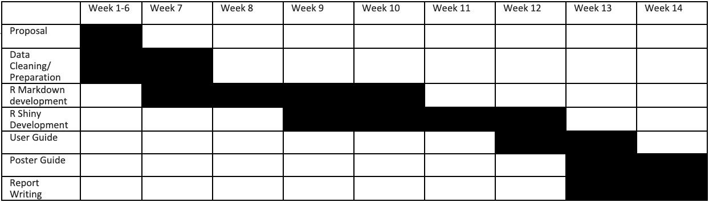

```{r setup, include=FALSE}
knitr::opts_chunk$set(echo = FALSE)
```

# Background  

GAStech provides many of their employees with company cars for their personal and professional use, but unbeknownst to the employees, the cars are equipped with GPS tracking devices. You are given tracking data for the two weeks leading up to the disappearance, as well as credit card transactions and loyalty card usage data.

# Motivation

The challenge requires us to analyze movement and tracking data from loyalty cards and credit cards. Our group is interested in finding out the hidden story behind the data. For example, if there is any mismatch between credit card history and his or her location. Therefore, we aimed to match the tables and explore more.   

# Project Objectives 

### This project aims to deliver a R Shiny Application which enables 

1. Interactive User interface that allows users to navigate the content at ease. 
2. Spending pattern between Employee credit card and loyalty card usage 
3. Visualize Geographical Data on employees personal/work route and routines 
4. Identify anomalies and suspicious behaviors 
5. Identify any relationship/employee interactions in GASTech 
6. Analyze tracking data and identify who are the users of credit cards and loyalty cards 

# Proposed Scope and Methodology 

### Exploratory Data Analysis (EDA) 
* Identify popular locations using the credit and loyalty data  
* Explore trends of spending behaviors by locations and identify anomalies 
* Explore time of spending using the timestamp datapoints and identify anomalies 

### Exploratory Spatial Data Analysis (ESDA)  
* Develop map using the geospatial data files and plot the routes travelled by each car ID by date and credit/Loyalty card usage on the map
* Identify potential informal and unofficial relationships among GASTech personnel with employees share the same/similar routes or frequently appear at same spots together. 
* Identify the correlations between the routes and card usage to infer the owners of each credit card/loyalty card. 

### Statistical Analysis
* Geospatial Clustering for transactions 
* Correlation analysis 
* Geographically weighted regression

### Project Timeline


# Storyboard & Visualization Features 
* First page: EDA (Dashboard Style) 
  + Employee favorite Hotspot 
  + Average of Individual credit card spending amount 
* Geospatial Map (with selection of date and employee(one/multiple)) - one page  
  + Show destination, cc / loyalty card used and time 
  + Show any other employees happen to be at the same location within the time frame 
* Statistical Analysis (eg. Selection of x-variables, y-variables, graph)  

# Data Preparation 
### Data Source 
* GPS data from the devices fitted in the employee cars 
* Employee car assignments
* Credit card swipe details
* Loyalty card details 
* Tourist map of the area - Abila 
* Shp files 
* prj file 

### Tools Used 
* Tableau 
* Microsoft Excel 

# Questions and Feedback
1. Is it necessary to answer all the questions in Mini-challenges  
2. Will prof Kam be teaching Statistical analysis? 
3. How to plot overlay map pictures in R