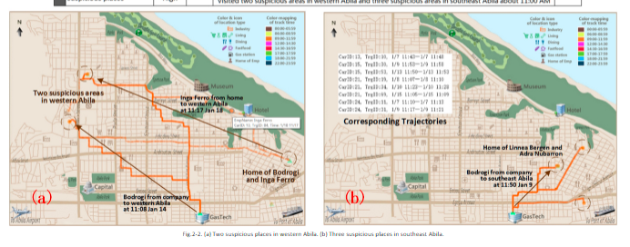
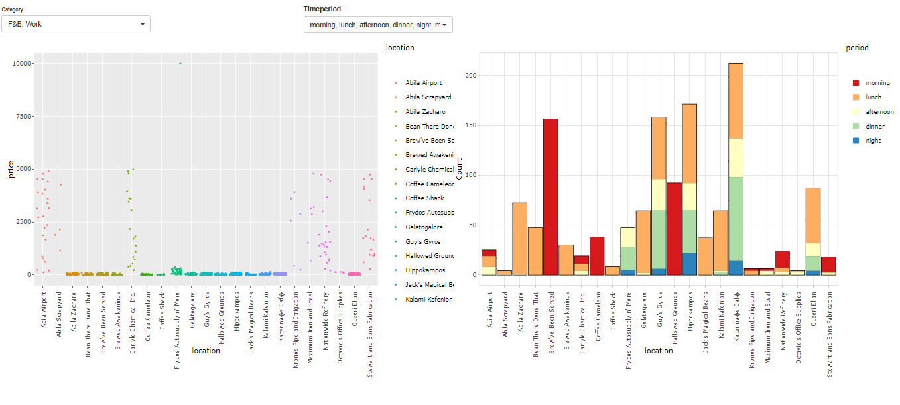
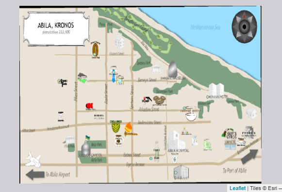
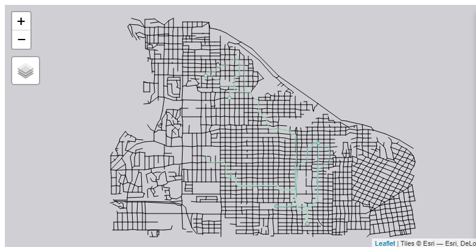
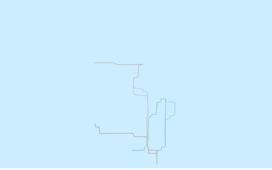
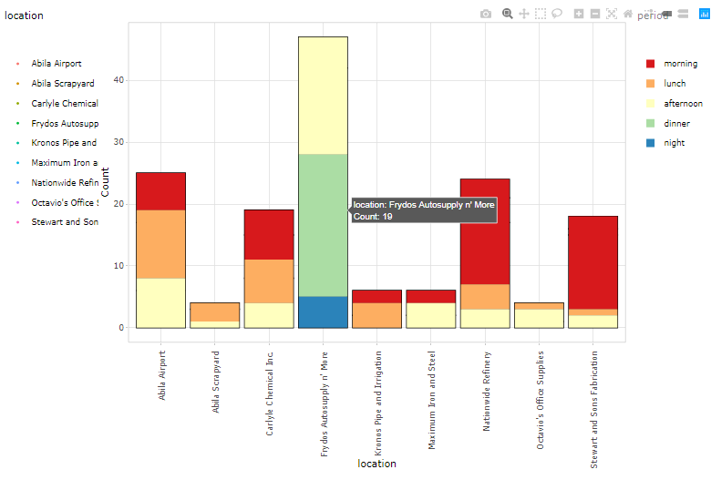
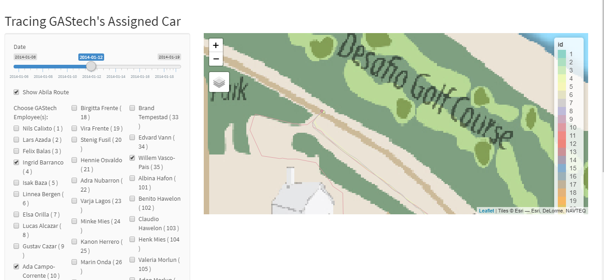
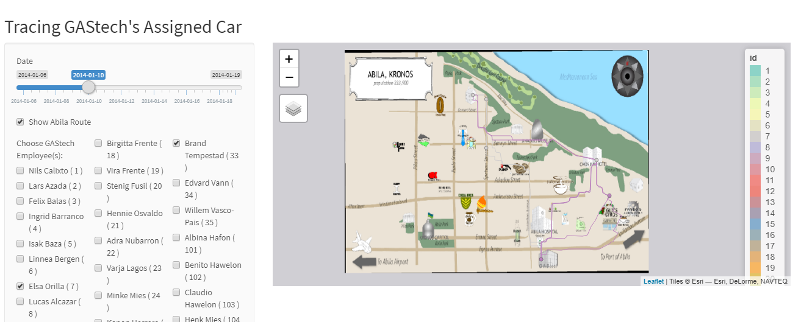
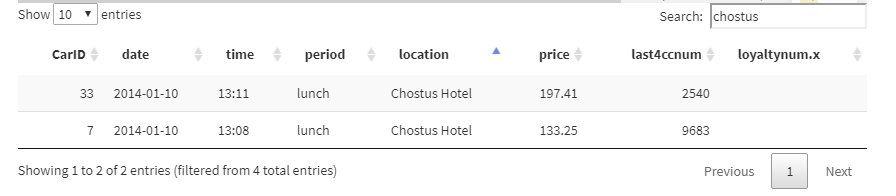

# Background and Introduction 

The Abila city was in unrest in the first month of 2014. The local company GAStech reported missing employees while multiple major outbreaks struck the city on the night of 23rd.

To investigate the incidents, multiple sources of evidences have been collated:

1. GAStech provides many of their employees with company cars for personal and professional use, but unbeknownst to the employees, the cars are equipped with GPS tracking devices. Beside that, to promote local business, GAStech also provides Kronos-Kares loyalty card in exchange for collecting information about their employee's credit card transactions and preferences recorded on loyalty cards. With the disappearance of GAStech employees in January 2014, GAStech released a tracking data of 2 weeks leading up to the disappearance, as well as the credit card transaction and loyalty card usage data.  

2. Relevant microblog records that have been identified by automated filters and text transcripts of emergency dispatches by the Abila, Kronos local police and fire departments.

Leveraging on the available information, different visual analysis have been used to support the investigations of these incidents and potentially contribute to local law enforcement to identify anomalies or suspicious pattern of behaviors.

# Motivation 
Appropriate visual approaches could largely reduce tediousness to scan through numbers and text data and improve investigation efficiency. Further empowered by the UI interactivity, trends and patterns of behaviors can be easily revealed with the ease of selections and filtering. 

However, real-life data is usually in different formats and users often need to spend much effort to perform analysis separately and draw meaningful insights. With the general lack of effective and easy to use web-enabled interactive and integrated applications for investigation, this project aims to build and publish an interactive RShiny web applications prototype to integrate different visual analysis together. The project attempts to enable the following analysis:  

1. To reveal city location hot-spots based on the spending data and to detect spending anomaly. The location data and the time of spending were split into different categories to sharpen the analysis. Investigators are able to scale down the scope of analysis with more focus on specific segments with the use of selections. 

2. To create an interactive map visualization framework that supports selection of time frame as well as employees. movement patterns of one or more employees are displayed to discover abnormal behaviors and unofficial relationships.

3. To build a timeline analysis for the chaotic night on 23rd based on text analytics. Leveraging on topic modelling techniques, meaningful themes are extracted from the massive amount of text data to help investigators form better understanding on the occurrence of events.

# Review and Critics

There has been work done on the map visualizations from the previous VAST Challenge submissions. Many teams have adopted the geo-visual approaches by adding the background map to reveal daily patterns of each individual and the potential relationships among the employees.

One of the example is from the team of Central South University. Through the combination of gps data and geo-referenced map, the team was able to visualize the movement patterns and clearly identify visited spots. However, the visual is hard-coded with static text labels as explanatory notes and hence the team needs to adjust the codes when tracks of other employees on other days are of the interest for the investigators. 

*Fig 1. Team of Central South University, VAST 2014 MC2 Submission*

Furthermore, by and large, most of the team submissions do not provide other related information such as credit card transaction histories for the focused employees hence the investigators may need to manually collect these information as well. 

One way to overcome these potential pitfalls on the geo-visual analysis is to leverage on interactive map with the flexibility of taking into variables based on user selections. A dynamic table of relevant information can also be displayed alongside to show the detailed information.

# Design Framework 
The design of iSpy application closely follows the data visualization general principles articulated by Schneiderman’s mantra: 

"Overview first, Zoom and Filter, then Details on demand". 

The application is able to display the overall demographics of the data objects and zoom into specific categories based on user selections. Details of the information are provided in the format of tooltips and data tables.

The prototype has 3 major components with each displaying on a different tab to ensure clarity.

## Exploratory Data Analysis

This page is designed to discover trends with the use of credit card transaction data. Both quantity and monetary amount of the transactions are utilized to reveal potential trends of spending patterns and discover anomalies. 

*Fig 2. First Tab Layout*

First of all, locations are categorized based on the nature of the locations. Three categories - F&B, Work and Lifestyle are used to label the locations. This helps to discover the trends of spending behaviors and visits in the particular categories.

Transaction data is also pre-processed and bucketized into 5 categories, namely Morning, Lunch, Afternoon, Dinner and Midnight. 'Lunch' and 'Dinner' periods are specially segregated as many F&B locations have high transactions during these two periods. 

A selection panel is displayed on the top of the page with two drop-down lists. Users could choose the location categories and Time period to zoom into details. The selections help to filter on the dataset and the visuals will dynamically change based on the choices. The selections are also designed to take in one or multiple inputs. PickleInput from the ShinyWidgets package further ensure the flexibility on selections with the options of selecting or de-selecting all choices.

The jitter plot on the left side displays each transaction at each location. The jitter plot is useful in identifying the anomaly from the clustered expenditures. For example, there is one transaction of *$10,000* from Frydos Autosupply n' More whilst rest of the transactions from the shop are below *$1,000*. An interactive tooltip displaying details of the transaction is shown when hovering around the particular transaction. 

The histogram plot on the right side displays the distribution of the transactions at each location. The plot is able to show the hot spots during different time period and when they are popular. A diverging colour scheme 'spectral' is applied to clearly differentiate the time periods.

## Geo-visual Analysis 

Geo-spatial approach is useful to track employees' movement patterns through space and time. An interactive map is displayed on this tab to discover the travelling patterns of employees and spot potential suspicious activities with a data table to show the detailed information.

The side interactive panel on the left enables selections of the focused time span and persons of interests. The user selections could dynamically filter the GPS data and display the traces on the map. 

The interactive map is built using the tmap package with four layers. 

The base layer is geo-referenced from the original tourist map in jpeg format using QGIS, an open source GIS package. 

*Fig 3. Base layer - Geo-referenced Abila tourist map*

The shapefile of abila is also added as the second layer to show the segragations of land, roads and streets. 
 

*Fig 4. Second layer - Abila shapefile*

Location spots are added as the third layer with longitudes and latitudes. 

*Fig 5. Third layer - location spots*

The traces of selected employees during the chosen time frame are added as the final layer for analysis.

*Fig 6. Fourth layer - Traces of employees*

The multi-layer map has the flexibility of zooming in and out as well as choosing layers to display. This greatly enable users to look at the travel patterns which provides useful information about the characteristics of the employee daily journey.

## Text Analysis 

Text analytics extracted frequent terms, word cloud and topic distribution from miniblogs and calls. With the aid of visual analytics, readers can look at the graphs instead of bunch of words. The page is designed to show the readers how word clouds, term frequency and topic distribution change over time. Firstly, readers can choose which information source they are more interested: miniblog or emergency calls. Secondly, they can choose detailed time period to focus on. Date is dropped in the column since it happened in the same day. Time are cut off by every 60 minutes start from 5 pm to 9 pm. 

<<<<<<< HEAD

*Fig 7. Wordcloud of the events*

*Fig 8. Blog term frequency by hours*

*Fig 9. Topic Distribution by hours*
=======

>>>>>>> d2390af3b1ddf506dac4f4775aec91490be4f5db

# Demonstration and Use Cases

The prototype of the iSpy can be found at this link. 

The demonstration of iSpy with the use of revelant data sources proves its ability to preprocess information in different formats and explore the trends and patterns of the data from visuals. This tool could facilitate investigations and provide valuable evidences to support allegations. 

# Discussion

The iSpy application reveals meaningful insights for investigation purposes with the user-friendly interactions.

## Exploratory Analysis
Two plots from the exploratory analsis tab work together to provide evidences on the suspicious activities. With a focused on work-related location histogram shown on Fig7, it is discovered that Frydos Autosupply n' More have transactions during the dinner and night hours whilst the rest of the work-related locations do not disply such patterns. With addition to the abnormal spending amount discovered from the jitter plot. Frydos Autosupply n' More could be circled as a location worthy more investigations.

*Fig 10. Number of transactions at each work-related location at different time*

## Geo-visual Analysis
The geo-visual analysis reveals official and unofficial relationships of the employees which are helpful evidences for investigations. For example, it is discovered that 3 Executives of GASTech ,Ingrid Barranco, Ada Campo-Corrente and Willem Vasco-Pais met at Desafio Golf Course on 12th, January.

*Fig 11. Executives Golf sessions on 12th Jan*

Furthermore, there were several Chostus Hotel Meetups by Elsa Orilla and Brand Tempestad during midday lunch hours on 8th, 10th, 14th and 17th. Their homes seem located at the same building as well. 

*Fig 12. Traces of Elsa Orilla and Brand Tempestad on 10th Jan*

However, based on the transaction details from below, they paid their bills separately.

*Fig 13. transactionns of Elsa Orilla and Brand Tempestad on 10th Jan at Chostus Hotel*

## Text Analysis 
There are 4 incidents we can conclude from the charts shown above. 

- At 6 pm, a fire started in the apartment dancing dolphin at 6 pm. The neighborhood evacuated themselves at 7 pm as the fire went stronger. People called fire station so firefighters came at 8 pm. The fire spreading is too fast to put out and injured the firefighters. Eventually, the fire caused explosion at 9 pm. Abila police arrested the suspects who started the fire. 

- At 7 pm, there was a shot fired by the officer.

- At 7 pm, there was also a hit and run accident caused by a black van. 

- There was a gathering event for Pok rally in Abila Park. Kronosstar is one of the key member from the organization. 

# Future Work

The iSpy prototype has its potential to be extended in the future. More visual components such as calendar view of semantic places can be added into the applications to complement the spatial analysis. This expands the dimensionality of the data objects and could potentially bring in more insights.

The geo-spatial analysis could be further enhanced with the use of [moveVis](http://movevis.org/) package to dynamically visualize movement data by creating video animations. This aids the visual interpretations of the movement patterns with traces following the timestamps in sequences.

# Acknowledgement 

The authors would like to thank Professor Kam Tin Seong for his kind support and guidance on the project. 

# References

---
references:
- id: 1 
  title: VAST Challenge 2014 Mini-Challenge 2 Submissions
  author: 
  - Team of Central South University
  type: website
  URL: http://visualdata.wustl.edu/varepository/VAST%20Challenge%202014/challenges/MC2%20-%20Patterns%20of%20Life%20Analysis/entries/Central%20South%20University/
- id: 2
  title: "The eyes have it: A task by data type taxonomy for information visualization"
  author:
  - B. Shneiderman
  volume: 196
  publisher: IEEE Conference on Visual Languages 
  page: 336-343
  type: article-journal
  issued:
    year: 2005
    month: 3
...

