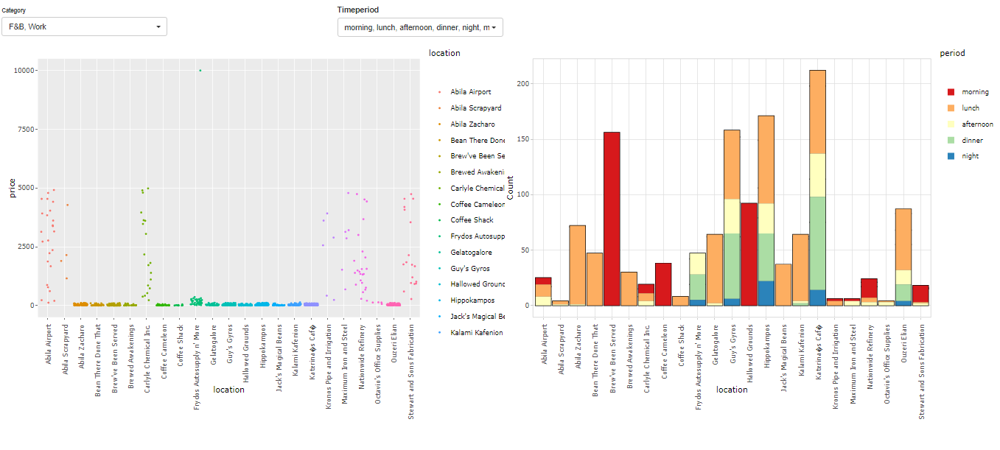

---
#color theme
primary_colour: '#1a17b3'
#secondary_colour: '#1a17b3'
#accent_colour: '#00A699'
column_numbers: 4
title: iSpy - An Interactive Visual Application for Exploring GAStech Employees Movement Data and Aliba, Kronos Events
author:
  - name: '**Hong Yun Ting**'
    email: ythong.2019@mitb.smu.edu.sg
    main: true
  - name: '**Li ShuXian**'
    email: shuxian.li.2020@mitb.smu.edu.sg
    main: true
  - name: '**Yang Xu**'
    email: xu.yang.2020@mitb.smu.edu.sg
    main: true

output: 
  posterdown::posterdown_html:
    self_contained: false
bibliography: packages.bib
---

```{r setup, include=FALSE}
knitr::opts_chunk$set(echo = FALSE)
```

# Introduction

The local company GAStech reported missing employees while multiple major outbreaks struck the city on the night of 23rd. To investigate the incidents, multiple sources of evidences have been collated:
1. GAStech released a tracking data of 2 weeks leading up to the disappearance as GAStech provides many of their employees with company cars for personal and professional use. GAStech also provided credit card transaction and Kronos-Kares loyalty card usage data.
2. Relevant microblog records that have been identified by automated filters and text transcripts of emergency dispatches by the Abila, Kronos local police and fire departments.

# Objectives
1. To reveal city location hot-spots based on the spending data and to detect spending anomaly. Investigators are able to scale down the scope of analysis with more focus on specific segments with the use of selections. 
2. To create an interactive map visualization framework that supports selection of time frame as well as employees. Movement patterns of one or more employees are displayed to discover abnormal behaviors and unofficial relationships.
3. To build a timeline analysis for the chaotic night on 23rd based on text analytics. Leveraging on topic modelling techniques are extracted from the massive amount of text data to help investigators form better understanding on the occurrence of events.

# Exploratory Data Analysis

{width=90%}

*Fig 1. First Tab Layout*

There are 3 kinds of locations based on its nature: F&B, Work and Lifestyle. Transactions are categorized into 5 types: Morning, Lunch, Afternoon, Dinner and Midnight. ‘Lunch’ and ‘Dinner’ periods are specially segregated as many F&B locations have high transactions during these two periods.

The jitter plot on the *left* side displays each transaction at each location.The jitter plot is useful in identifying the **anomaly** from the clustered expenditures. The histogram plot on the *right* side displays the distribution of the transactions at each location.The plot is able to show the hot spots during different time period and when they are popular. 

{width=90%}

*Fig 2. transactionns of Elsa Orilla and Brand Tempestad on 10th Jan at Chostus Hotel*

Two plots from the exploratory analsis tab work together to provide evidences on the suspicious activities. With a focused on work-related location histogram shown on Fig2,it is discovered that Frydos Autosupply n’ More have transactions during the dinner and night hours whilst the rest of the work-related locations do not disply such patterns.With addition to the abnormal spending amount discovered from the jitter plot. Frydos Autosupply n’ More could be circled as a location worthy more investigations.

# Geo-visual Analysis

Geo-spatial approach is useful to track employees’ movement patterns through space and time.The geo-visual analysis reveals official and unofficial relationships of the employees which are helpful evidences for investigations. For example, it is discovered that 3 Executives of GASTech ,Ingrid Barranco, Ada Campo-Corrente
and Willem Vasco-Pais met at Desafio Golf Course on 12th, January.

{width=90%}

*Fig 3. Executives Golf sessions on 12th Jan*

Furthermore, there were several Chostus Hotel Meetups by Elsa Orilla and Brand Tempestad during midday lunch hours on 8th, 10th, 14th and 17th. Their homes seem located at the same building as well.

{width=90%}

*Fig 4. Traces of Elsa Orilla and Brand Tempestad on 10th Jan*

However, based on the transaction details from below, they paid their bills separately.


*Fig 5. transactionns of Elsa Orilla and Brand Tempestad on 10th Jan at Chostus Hotel*

# Text Analysis

Text analytics extracted frequent terms, word cloud and topic distribution from miniblogs and calls. With the aid of visual analytics, readers can look at the graphs instead of bunch of words. The page is designed to show the readers how word clouds, term frequency and topic distribution change over time. Firstly, readers can choose which information source they are more interested: miniblog or emergency calls. Secondly, they can choose detailed time period to focus on. Date is dropped in the column since it happened in the same day. Time are cut off by every 60 minutes start from 5 pm to 9 pm. 

{width=90%}

*Fig 6. Wordcloud of the events*

{width=90%}

*Fig 7. Blog term frequency by hours*

{width=90%}

*Fig 8. Topic Distribution by hours*

There are 4 incidents we can conclude from the charts shown above. 
1. At 6 pm, a fire started in the apartment dancing dolphin at 6 pm. The neighborhood evacuated themselves at 7 pm as the fire went stronger. People called fire station so firefighters came at 8 pm. The fire spreading is too fast to put out and injured the firefighters. Eventually, the fire caused explosion at 9 pm. Abila police arrested the suspects who started the fire. 
2. At 7 pm, there was a shot fired by the officer.
3. At 7 pm, there was also a hit and run accident caused by a black van. 
4. There was a gathering event for Pok rally in Abila Park. Kronosstar is one of the key member from the organization. 

# Conclusion
In this work we presented an integrated visual analytics dashboard for public and government analysis of tracking data, history of credit card, loyalty card and social media data. Multiple text mining, visualisation techniques were applied to further investigate things happened in Abila city in 2014. Abnormal behaviors were discovered. 
